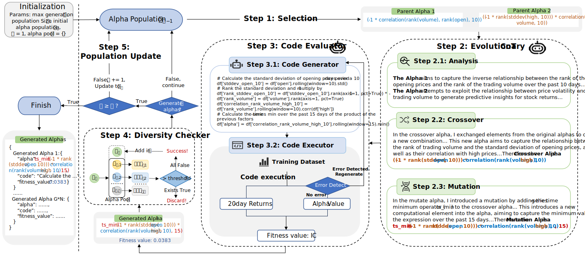

# EvoAlpha: An LLM-Enhanced Evolutionary Framework for Formulaic Alpha Mining

EvoAlpha is a novel formulaic alpha mining framework, which leverages Large Language Models (LLMs) to guide the evolutionary process, reduce the search space, and then generate diverse, high-quality alphas. Specifically, we first propose an LLM-enhanced Evolutionary Chain-of-Thought that facilitates the analysis, crossover, and mutation processes to generate high-quality alphas and efficiently narrow the search space. To enhance evaluation efficiency, we then introduce a Code Evaluator that translates the newly generated alphas into executable code with the assistance of an LLM. Finally, these alphas are filtered by a diversity checker and ultimately used to optimize iteratively. 

## Overview

EvoAlpha aims to address the issues present in previous formulaic alpha mining methods: 

* the vast search space of alpha mining;

* the generation of numerous invalid and meaningless alphas;

* the inflexibility and inconvenience of relying on external parsers. 

EvoAlpha utilizes the external knowledge of LLMs to enhance EAs, therefore effectively narrowing the exploration space. By leveraging the powerful capabilities of LLMs, EvoAlpha takes the intrinsic semantic information of alphas into account during the evolutionary process, enabling the generation of more high-quality and diverse alphas with financial meaning. Moreover, we also utilize LLMs to convert these alphas into codes, making them easier to evaluate and apply.

## Important Reminder

We have released the examples, prompt templates, and core code of this project for reference and preliminary use.

The alpha example we provide is for reference and illustrative purposes only, intended to help understand the methodological workflow (serving the same role as case studies), and do not represent the well-performing alphas. The quality of mined alphas will continue to improve with an increase in iteration rounds. 

More importantly, rigorous and detailed evaluation is required before any practical application in quantitative investment strategies. As our method only focuses on **mining alphas with LLMs**, the rigorous evaluation, selection and application of these alphas in actual investment have not yet been thoroughly explored, which will be the focus of our research team's follow-up work. Therefore, please do not use these alphas for investment without strict testing and evaluation.

**Investment Disclaimer**: All content in this repository is for academic and research purposes only and does not constitute any investment advice, investment recommendation or transaction suggestion. Investment involves inherent risks, and any investment decision made based on the content of this repository shall be at the investor's own risk.
